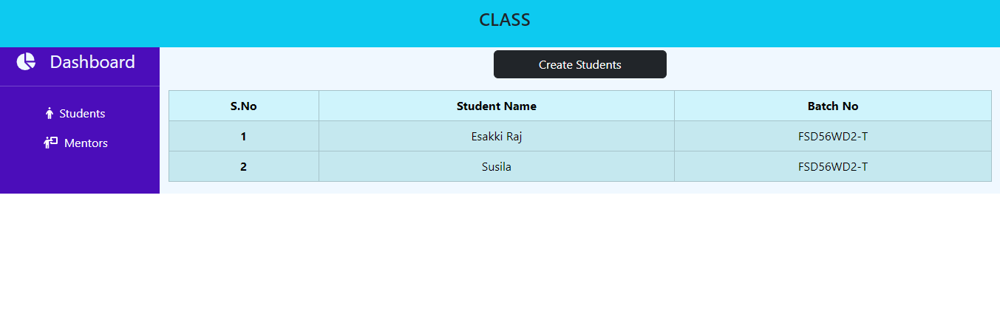

## Nodejs- Day -3: Node & mongo DB connectivity   

**Assigning Mentor and Students with Database task**    

 - I have completed and submitted Assigning Mentor and Students with Database task, kindly check and verify it.   
 
 - I completed this task using MERN Stack    
 
  **Technology used:**     

 - HTML
 - CSS
 - React JS 
 - Bootstrap
 - Node JS
 - Express JS
 - MONGO DB

 **Task URL:**  https://app-class.netlify.app

 ## Installation steps:

1. Clone the repository (or) Download the projects:

    ``` bash

    git clone https://github.com/EsakkiRajM/FullStackApp.git   

    ```

2. Navigate to the project directory:

    ```bash
    cd Your-Project-Foldername
    ```

3. Install dependencies:

   Use the following commands to get a node_modules libs

    ```bash
    npm install
    ```

4. Run the project:

    Run the following commands to see the output

    ```bash
    npm run dev
    ```
5. Also download the Backend Folders:

    Backend URL:

    https://github.com/EsakkiRajM/FullStackApp/tree/ClassApp-BE

    

- I have attached `Output image` for your reference  

   **Output:**

 

